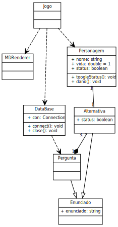
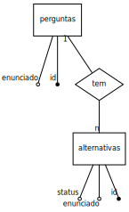

# QuizCC

## (cc significa Ciência da Computação)

Um jogo de perguntas e respostas de dois jogadores que eu fiz para um trabalho
da minha faculdade usando Java, JavaFX e SQLite.

## Como rodar

Você precisa do JDK 17 ou mais recente, se você estiver usando o NetBeans quando
abrir o projeto vai aparecer uma janela de aviso, é so clicar no botão "reparar"
nela e na janela subsequente.

Caso você esteja na linha de comando, vai precisar instalar o Gradle, e é só
rodar:

    gradle run

## Diagrama de classes

## Modelo entidade relacionamento do banco de dados

## Créditos

Autor: [Pedro Debs](https://github.com/melby-md) <<pedrodebs1@gmail.com>>

QuizCC é software livre, está licenciado sob os termos da
[Licença MIT](https://spdx.org/licenses/MIT.html), e o código fonte está
dispovinel em <https://github.com/melby-md/quizcc>.

